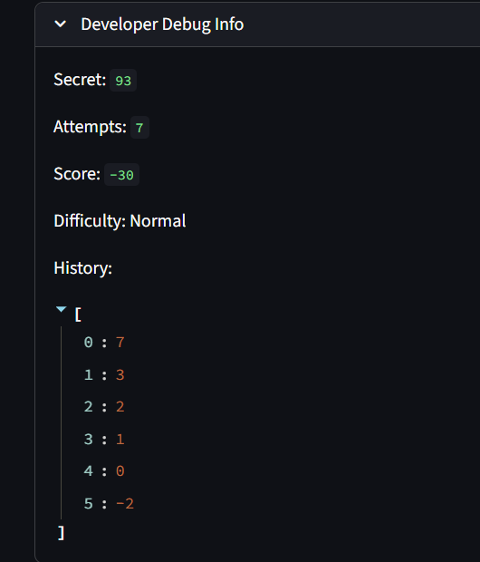

# 🎮 Game Glitch Investigator: The Impossible Guesser

---

**PHASE 1** - Initial Observations:

- Playing the gane the first time I startet with number 7 -> The hint was "Go lower." Then I entered 3, 2, 1 and the hint kept saying "Go lower" every time. Based on the prompt provided, we are supposed to guess a number between 1 and 100. However, even after entering "1" it told me to go lower, which shouldn't be the case.
  => Most likely wrong logic -> Need to check how the logic is written when we enter the number that is lower or higher that the target number. Does it always say "Go lower"? Or does it say "Go lower" when it should say "Go higher"?

- Every time I enter a wrong guess, my score went down by 5 points. So, after 5 attempts my score was -25.
  => Potential bug: our score shouldn't go below 0 (unless intended to be negative)

By looking at the "Developer Debug Info," we can see that our history starts with attempt 0. It can confuse some players -> potentially needs to be changed to start with 1 instead.

After entering 7 guesses, it tells you that you are out of moves and prompts to start a new game. However, still shows 1 attempt left -> need to check the logic of tracking attempts and calculating the number of attempts left.

After clicking on "New Game":

- Secret number changed
- Number of attempts changed to 8
- Attempts (used) became 0
- Score kept from the first game
- History from all the previous attempts can be seen

When trying to guess a new number -> Kept saying "Game over. Start a new game to try again" and number of attempts available didn't change.
=> Need to check logic where it supposed to restart the game.

Additional Observation:

Easy level range: 1 - 20
Normal level range: 1 - 100
Hard level range: 1 - 50

It would make more sense if Normal and Hard levels ranges were switched.

**PHASE 2** - Repairs

If we look at the code within app.py, we can see a few issues right away:

1. get_range_for_difficulty() function includes ranges for different levels of difficulty that need to be fixed:
   Normal range changed to 1 - 50
   Hard level range changed to 1 - 100

2. check_guess() function checks if our guess > secret
   If it is -> Gives us a hint "Go Higher," otherwise says "Go Lower"
   The logic is wrong -> I reversed it

**_HINTS for STUDENTS_**:

- Try entering range edges as your guesses (for example, 1 and 100) and check whether it keeps telling you to go Higher or Lower. Is it an appropriate behavior?

- Try switching between levels of difficulty. Do the ranges make sense?

---

## 🚨 The Situation

You asked an AI to build a simple "Number Guessing Game" using Streamlit.
It wrote the code, ran away, and now the game is unplayable.

- You can't win.
- The hints lie to you.
- The secret number seems to have commitment issues.

## 🛠️ Setup

1. Install dependencies: `pip install -r requirements.txt`
2. Run the broken app: `python -m streamlit run app.py`

## 🕵️‍♂️ Your Mission

1. **Play the game.** Open the "Developer Debug Info" tab in the app to see the secret number. Try to win.
2. **Find the State Bug.** Why does the secret number change every time you click "Submit"? Ask ChatGPT: _"How do I keep a variable from resetting in Streamlit when I click a button?"_
3. **Fix the Logic.** The hints ("Higher/Lower") are wrong. Fix them.
4. **Refactor & Test.** - Move the logic into `logic_utils.py`.
   - Run `pytest` in your terminal.
   - Keep fixing until all tests pass!

## 📝 Document Your Experience

- [ ] Describe the game's purpose.
- [ ] Detail which bugs you found.
- [ ] Explain what fixes you applied.

## 📸 Demo

- [ ] [Insert a screenshot of your fixed, winning game here]

## 🚀 Stretch Features

- [ ] [If you choose to complete Challenge 4, insert a screenshot of your Enhanced Game UI here]
